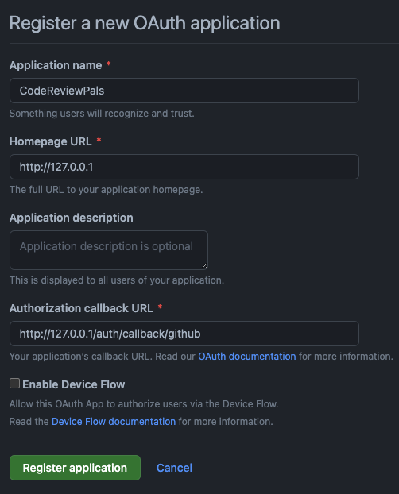

<div align="center">
<picture>
  <source media="(prefers-color-scheme: dark)"  srcset="https://raw.githubusercontent.com/geeksesi/code-review-pals/master/resources/images/logo-white-350.png">
  <source media="(prefers-color-scheme: light)" srcset="https://raw.githubusercontent.com/geeksesi/code-review-pals/master/resources/images/logo-350.png">
  
</picture>
    <br/><br/>
  <a href="https://discord.gg/3G8cvWr7q4" ></a>
</div>

---
<div align="center">


</div>

---

# Code Review Pals
Code Review Pals is a community-driven platform for code review, designed to help developers learn from each other and improve their skills by providing a place to share their code and get feedback from peers.

Our goal is to encourage developers of all levels to submit their code for review and to foster a supportive and collaborative environment where senior developers can help juniors learn and grow. We believe that code review is a vital part of the software development process, and that it helps improve code quality, catch bugs and security issues, and share knowledge.

**Our Stack**
- Back
    - PHP >= 8.1 ( prefer 8.2 )
    - Laravel >= 10.0
    - node.js >= 17.4
    - MySQL >= 8.9
    - Redis > 7.0
    - Sail
- Front
    - React >= 18.2
    - Tailwind >= 3.2
    - Inertia >= 1.0
    - Vite >= 4.0

## How to setup development environment

> **WARNING** -  You need to have Composer (**Composer -V** to verify)  and Docker installed to continue

First of all, you'll need to fork the project, then clone your repo
```
git clone git@github.com:{YOUR_ACCOUNT_NAME}/code-review-pals.git && cd code-review-pals
```
Duplicate the `.env.exemple` file as `.env`and change the following lines

| .env.exemple               | .env                       |
|----------------------------|----------------------------|
| `APP_URL=http://localhost` | `APP_URL=http://127.0.0.1` |
| `DB_HOST=127.0.0.1`        | `DB_HOST=mysql`            |

<details>
<summary><b>If you need to work on authenticated pages</b></summary>

On your Github Account, go to `Settings > Developer Settings > OAuth App`

Then fill in the form as the following :



After registering, create your client secret and put `http://127.0.0.1` as the Homepage URL

In `.env` file, at the very bottom, fill in the github section with the credentials given after register the app on GitHub.

```
GITHUB_CLIENT_ID= /*YOUR CLIENT ID*/
GITHUB_CLIENT_SECRET= /*YOUR CLIENT SECRET*/
GITHUB_REDIRECT=http://127.0.0.1/auth/callback/github
```
</details>

Install Sail on docker, install dependencies, initialize database, launch instances
```
docker run --rm \
    -u "$(id -u):$(id -g)" \
    -v "$(pwd):/var/www/html" \
    -w /var/www/html \
    laravelsail/php82-composer:latest \
    composer install --ignore-platform-reqs
```

```
./vendor/bin/sail npm i && ./vendor/bin/sail composer update
```

Generate the application key
```
./vendor/bin/sail php artisan key:generate 
```

```
./vendor/bin/sail artisan migrate:fresh --seed
```
```
./vendor/bin/sail up -d
```
**And you are good to go :)**

When you are done, don't forget to cut docker
```
./vendor/bin/sail down
```

# Contribution
If you're interested in contributing to Code Review Pals, please check out the [Issues](https://github.com/geeksesi/code-review-pals/issues) and join our community. Together, we can make code review a more accessible and rewarding experience for everyone.

# License
Code Review Pals is Licensed under The MIT License (MIT). Please see [License File](https://github.com/geeksesi/code-review-pals/blob/master/LICENSE) for more information.
